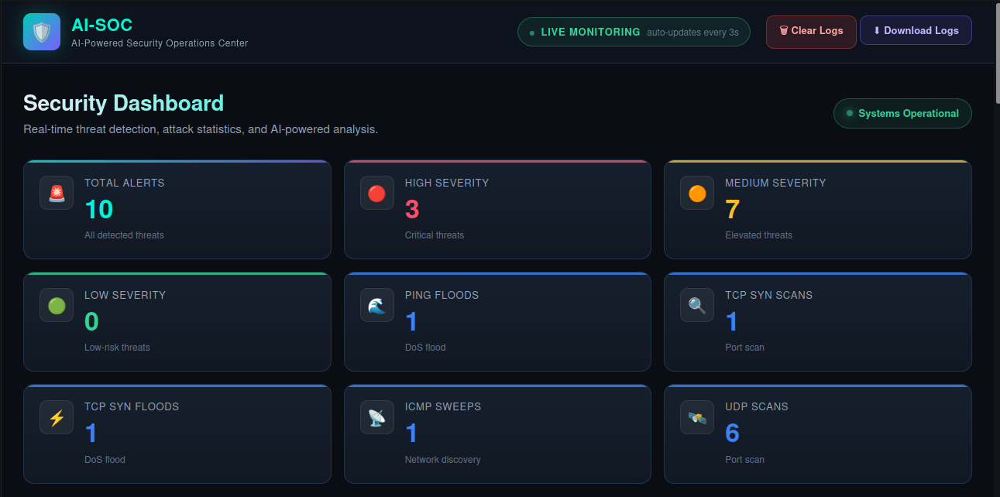
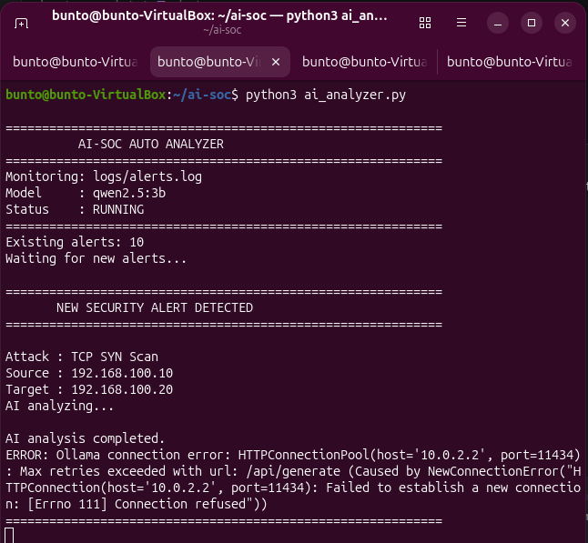

<div align="center">
🛡️ AI-SOC
AI-Powered Security Operations Center
A lightweight, local cybersecurity monitoring platform for network attack detection, MITRE ATT&CK mapping, AI-assisted threat analysis, and SOC visualization.


</div>
---
👋 About the Project
AI-SOC is a practical cybersecurity project that demonstrates how a small Security Operations Center can be built using open-source technologies.
The system monitors network traffic, detects predefined attack patterns, generates structured alerts, maps selected detections to MITRE ATT&CK, sends alerts to a locally hosted Qwen 2.5 3B model through Ollama, and presents the results through a Flask-based SOC dashboard.
> 🎯 \*\*Project goal:\*\* Build an understandable end-to-end SOC pipeline rather than a black-box security tool.
---
🚀 What AI-SOC Can Do
Capability	Description
🔎 Packet Monitoring	Captures and inspects network traffic with Scapy
🚨 Attack Detection	Detects five controlled network attack patterns
📝 Alert Logging	Stores structured security alerts
🧠 AI Analysis	Uses local Qwen 2.5 3B through Ollama
🎯 MITRE Mapping	Associates selected attacks with ATT&CK techniques
📊 SOC Dashboard	Displays alerts, statistics, filters and charts
🔍 IP Filtering	Search alerts by source/destination IP
📥 Log Export	Download collected alert logs
🧪 Lab Testing	Designed for controlled VirtualBox security testing
---
🏗️ Architecture
```text
                    ┌─────────────────────┐
                    │     Kali Linux      │
                    │   192.168.100.10    │
                    └──────────┬──────────┘
                               │
                    Controlled Network Traffic
                               │
                               ▼
                    ┌─────────────────────┐
                    │    Ubuntu AI-SOC    │
                    │   192.168.100.20    │
                    └──────────┬──────────┘
                               │
                               ▼
                    ┌─────────────────────┐
                    │  Scapy Detection    │
                    │     detector.py     │
                    └──────────┬──────────┘
                               │
                         Detection Event
                               │
                               ▼
                    ┌─────────────────────┐
                    │    Alert Logger     │
                    │      logger.py      │
                    └──────────┬──────────┘
                               │
                     ┌─────────┴─────────┐
                     ▼                   ▼
              ┌──────────────┐   ┌───────────────┐
              │ alerts.log   │   │ AI Analyzer   │
              │              │   │ ai\_analyzer.py│
              └──────┬───────┘   └───────┬───────┘
                     │                   │
                     │                   ▼
                     │            ┌─────────────┐
                     │            │ Qwen 2.5 3B │
                     │            │   Ollama    │
                     │            └──────┬──────┘
                     │                   │
                     └─────────┬─────────┘
                               ▼
                    ┌─────────────────────┐
                    │   Flask Dashboard   │
                    │     dashboard.py    │
                    └──────────┬──────────┘
                               ▼
                    ┌─────────────────────┐
                    │    SOC Web UI       │
                    │ Alerts • Charts     │
                    │ Filters • AI Panel  │
                    └─────────────────────┘
```
---
🧩 Project Structure
```text
AI-SOC/
│
├── detector.py              # Network packet detection engine
├── logger.py                # Security alert logger
├── ai\_analyzer.py           # Local AI threat analysis
├── dashboard.py             # Flask web application
├── config.py                # Project configuration
│
├── templates/
│   └── index.html            # SOC dashboard UI
│
├── static/
│   └── css/
│       └── style.css         # Dashboard styling
│
├── logs/
│   ├── alerts.log            # Generated security alerts
│   └── ai\_analysis.json      # AI analysis data
│
├── requirements.txt
├── README.md
└── .gitignore
```
---
🛡️ Detection Coverage
The current version has been tested against five controlled attack scenarios.
#	Detection	Description	Status
01	🔵 ICMP Sweep	Detects ICMP probing across multiple targets	✅
02	🌊 Ping Flood	Detects high-volume ICMP Echo Requests	✅
03	🔍 TCP SYN Scan	Detects repeated TCP SYN scanning activity	✅
04	⚡ TCP SYN Flood	Detects high-volume TCP SYN flooding	✅
05	📡 UDP Scan	Detects UDP probing/scanning activity	✅
---
🎯 MITRE ATT&CK Mapping
Selected detections are mapped to MITRE ATT&CK techniques.
Attack	Technique	MITRE Name
ICMP Sweep	`T1046`	Network Service Discovery
Ping Flood	`T1498.001`	Network Denial of Service: Direct Network Flood
TCP SYN Flood	`T1498.001`	Network Denial of Service: Direct Network Flood
> Additional ATT\&CK mappings can be added as new detection rules are implemented.
---
🖥️ Project Screenshots
The following section is intentionally structured so screenshots can be added directly to the repository.
01 — Main SOC Dashboard
> 📸 \*\*Add screenshot:\*\* `docs/screenshots/dashboard.png`

Show the main dashboard with statistics, attack charts and the alert table.
---
02 — Live Security Alerts
> 📸 \*\*Add screenshot:\*\* `docs/screenshots/alerts.png`

Show detected attacks appearing in the SOC alert table.
---
03 — AI Threat Analysis
> 📸 \*\*Add screenshot:\*\* `docs/screenshots/ai-analysis.png`

Show the Qwen-generated threat summary, MITRE technique and recommended actions.
---
04 — Detection Engine
> 📸 \*\*Add screenshot:\*\* `docs/screenshots/detection-engine.png`

Show `detector.py` running and detecting an attack from Kali Linux.
---
05 — Network Testing
> 📸 \*\*Add screenshot:\*\* `docs/screenshots/network-test.png`

Show Kali Linux generating controlled test traffic and the Ubuntu sensor receiving it.
---
06 — Packet Capture Verification
> 📸 \*\*Add screenshot:\*\* `docs/screenshots/tcpdump.png`

Show `tcpdump` confirming packets are arriving on the monitoring interface.
---
🧠 AI Threat Analysis
AI-SOC integrates a locally hosted language model to provide additional context for detected alerts.
Pipeline
```text
Security Alert
      ↓
Flask /api/analyze
      ↓
ai\_analyzer.py
      ↓
Ollama
      ↓
Qwen 2.5 3B
      ↓
Threat Analysis
      ↓
SOC Dashboard
```
The dashboard can present information such as:
Threat summary
Why the event matters
MITRE ATT&CK technique
Recommended actions
Running the model locally also keeps the analysis workflow suitable for a private cybersecurity laboratory.
---
📊 Dashboard Features
🚨 Alert Statistics
Displays the number of detected events and selected attack categories.
📈 Attack Charts
The dashboard includes visual attack statistics using Chart.js.
🔍 Filtering
Alerts can be filtered by attack type or searched using an IP address.
📄 Pagination
Large alert lists are split into manageable pages.
🤖 AI Analysis
Each alert can be sent to the AI analyzer from the dashboard.
📥 Log Download
The collected alert log can be downloaded directly from the dashboard.
---
🧪 Laboratory Environment
AI-SOC was developed and tested using a controlled VirtualBox environment.
```text
Kali Linux
eth1
192.168.100.10/24
       │
       │ Host-only / isolated lab network
       │
       ▼
Ubuntu AI-SOC
enp0s8
192.168.100.20/24
```
Connectivity was verified with ICMP and packet capture.
Example verification:
```bash
ping -c 4 192.168.100.20
```
Packet capture:
```bash
sudo tcpdump -ni enp0s8 icmp
```
---
⚙️ Installation
1. Clone the repository
```bash
git clone https://github.com/ULS-sankar/AI-SOC.git
cd AI-SOC
```
2. Create a virtual environment
```bash
python3 -m venv venv
```
3. Activate it
```bash
source venv/bin/activate
```
4. Install dependencies
```bash
pip install -r requirements.txt
```
---
🤖 Ollama Setup
Install Ollama on the machine hosting the model and make sure the required model is available.
Example:
```bash
ollama pull qwen2.5:3b
```
Verify:
```bash
ollama list
```
The analyzer should be able to reach the Ollama API before AI analysis is tested.
---
▶️ Running AI-SOC
Start the Detection Engine
```bash
cd \~/ai-soc
sudo venv/bin/python detector.py
```
Start the AI Analyzer
```bash
cd \~/ai-soc
source venv/bin/activate
python3 ai\_analyzer.py
```
Start the Dashboard
```bash
cd \~/ai-soc
source venv/bin/activate
python3 dashboard.py
```
Then open:
```text
http://127.0.0.1:5000
```
---
🧪 Testing
All attack testing should be performed only inside the authorized lab environment.
Example controlled tests:
```bash
# ICMP sweep
sudo nmap -PE -sn 192.168.100.0/24

# Ping flood
sudo ping -f -c 100 192.168.100.20

# TCP SYN scan
sudo nmap -sS -p 1-1000 192.168.100.20

# TCP SYN flood
sudo hping3 -S --flood -p 80 192.168.100.20

# UDP scan
sudo nmap -sU -p 1-100 192.168.100.20
```
Use these only against the isolated test environment or systems for which explicit authorization exists.
---
🔄 End-to-End Workflow
```text
1. Kali generates controlled traffic
             ↓
2. Ubuntu receives packets
             ↓
3. detector.py inspects traffic
             ↓
4. Detection rule is triggered
             ↓
5. logger.py creates alert
             ↓
6. alerts.log stores the event
             ↓
7. ai\_analyzer.py processes alert
             ↓
8. Qwen 2.5 3B analyzes threat
             ↓
9. Flask dashboard presents results
```
---
🔐 Security Design
AI-SOC follows a simple defensive architecture:
Local network monitoring
Rule-based detection
Structured security logging
MITRE ATT&CK context
Local AI analysis
Web-based SOC visualization
The project is intended for education, experimentation, portfolio demonstration, and controlled cybersecurity research.
---
⚠️ Current Limitations
AI-SOC is a working prototype rather than an enterprise SIEM.
Current limitations include:
Rule/threshold-based detection
Limited attack coverage
Local single-node deployment
No enterprise authentication system
No distributed log collection
No full incident-response automation
AI output depends on the local model
No persistent production database
Dashboard real-time capabilities are intentionally lightweight
---
🚀 Future Roadmap
Phase 1 — Core SOC
[x] Packet monitoring
[x] Attack detection
[x] Alert logging
[x] Flask dashboard
[x] MITRE ATT&CK mapping
[x] AI analysis
Phase 2 — Detection Expansion
[ ] ARP spoofing detection
[ ] DNS scan detection
[ ] Brute-force detection
[ ] Port scan improvements
[ ] Suspicious traffic baselining
Phase 3 — SOC Improvements
[ ] Database-backed alerts
[ ] Better live dashboard updates
[ ] Alert severity scoring
[ ] Advanced filtering
[ ] Authentication and roles
Phase 4 — AI / Automation
[ ] AI incident prioritization
[ ] Automated investigation summaries
[ ] Alert correlation
[ ] Safe automated response
[ ] Notification integrations
---
📚 Technologies Used
<div align="center">
Technology	Purpose
Python	Core development
Scapy	Packet capture and inspection
Flask	SOC web dashboard
Chart.js	Dashboard visualization
Ollama	Local AI model runtime
Qwen 2.5 3B	Threat analysis
MITRE ATT&CK	Threat technique mapping
Kali Linux	Security testing
Ubuntu	AI-SOC monitoring server
VirtualBox	Isolated laboratory
Git & GitHub	Version control
</div>
---
📌 Repository
GitHub:  
https://github.com/ULS-sankar/AI-SOC
---
👨‍💻 Author
<div align="center">
Sasi Sankar
M.Tech Integrated Computer Science Student  
Cybersecurity Enthusiast • Developer • Artist
Building practical cybersecurity projects and exploring:
`Cybersecurity` · `SOC` · `Network Security` · `Python` · `AI` · `Web Development`
</div>
---
⭐ If You Find This Useful
If this project helps you understand SOC architecture, detection engineering or AI-assisted security analysis, consider giving the repository a ⭐.
<div align="center">
🛡️ Detect → Analyze → Understand → Respond
</div>